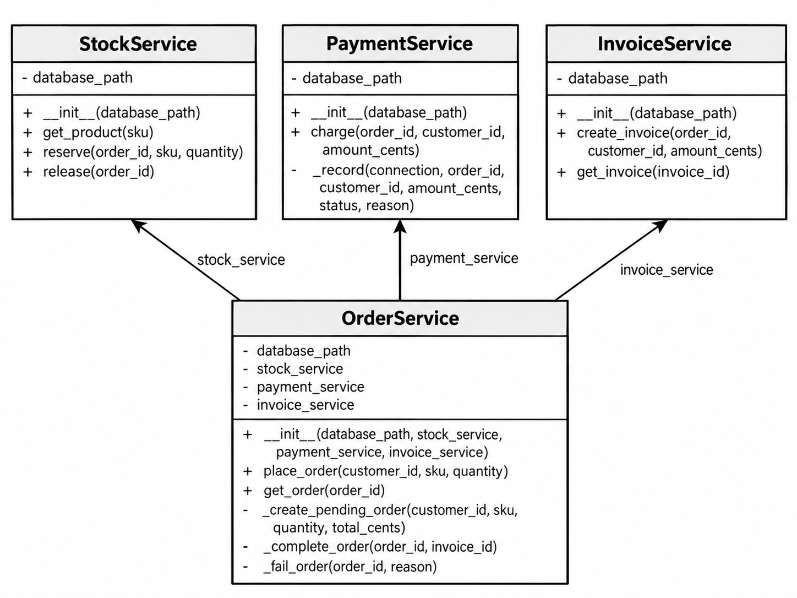
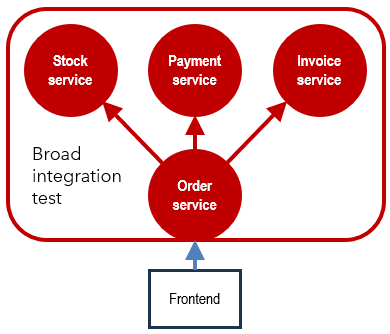
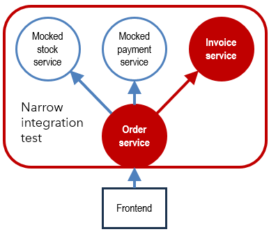

# Orders
Example of narrow vs. broad integration tests based on the backend for an eshop's ordering system.

## Class Diagram

## Testing Strategy

Although the backend offers an API (`POST /orders`, `GET /orders/{id}`, `GET /invoices/{id}`), the integration tests test the classes' public methods directly.

The broad integration tests test the interaction of the order service with the stock, payment, and invoice services.

The narrow integration tests test the interaction of the order service with the invoice service and mock the stock and payment services.

There are positive (happy path) and negative (stock unavailable, payment rejected) tests.

## Usage
1. Create a Python virtual environment: `python -m venv venv`
2. Activate it: `venv\Scripts\activate`, `.\venv\Scripts\Activate`, `source venv/bin/activate`, depending on OS and CLI
3. Install the dependencies: `pip install -r requirements.txt`
4. Run the tests: 
    - Broad integration tests: `pytest tests/test_broad_integration.py`
    - Narrow integration tests: `pytest tests/test_narrow_integration.py`
    - All of them: `pytest`

## Tools
SQLite / Flask / Python / pytest / pytest-mock

## Author
Codex 5.5, prompted by Arturo Mora-Rioja.